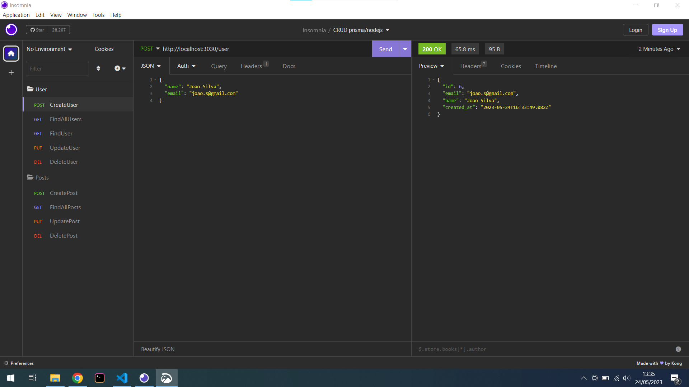
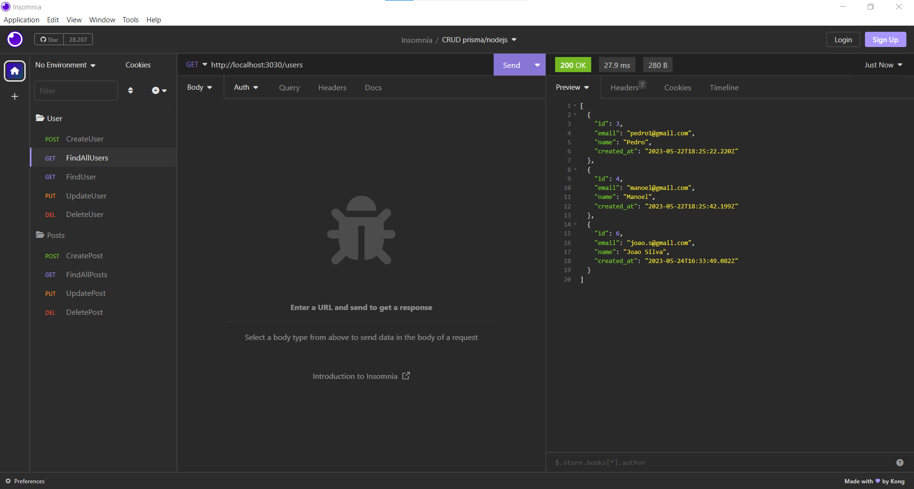
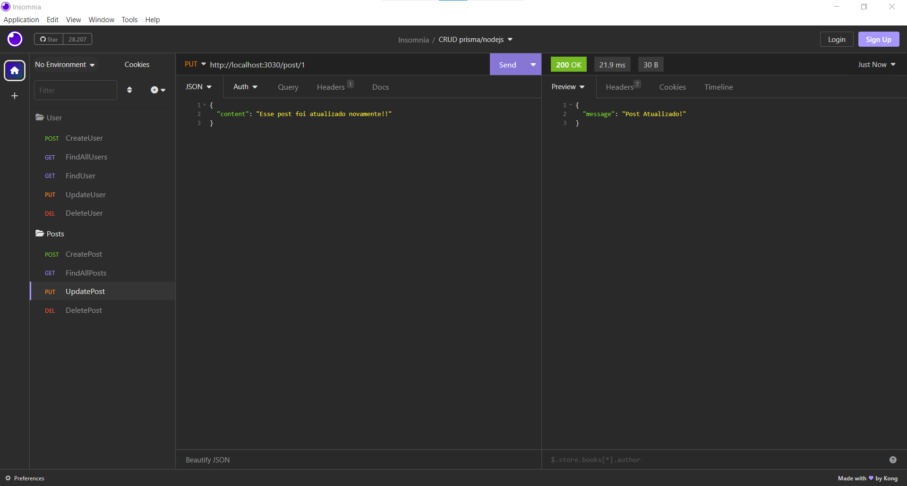
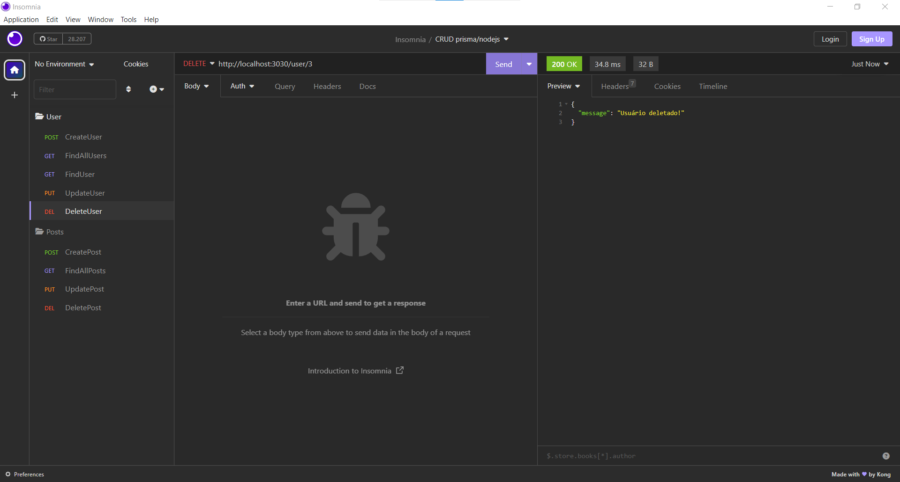

# API REST com Node.js, Express, Prisma e SQLite

Esta é uma API REST criada com Node.js, Express, Prisma e SQLite. Ela fornece endpoints para gerenciar usuários e posts.

## Configuração

Certifique-se de ter o Node.js instalado em sua máquina. Clone o repositório e instale as dependências:

```
git clone https://github.com/WalSacramento/APIREST_Prisma_e_Nodejs.git
cd APIREST_Prisma_e_Nodejs
npm install
```


## Banco de dados

A API utiliza um banco de dados SQLite para armazenar os dados. O arquivo do banco de dados (`dev.db`) é criado automaticamente ao iniciar o servidor.

## Executando a API

Para iniciar o servidor, execute o seguinte comando:

`npm run dev`

O servidor estará em execução em `http://localhost:3000`.

## Rotas

A API fornece as seguintes rotas:

### Usuários

#### Criação de usuário

POST /user


Cria um novo usuário. Os dados do usuário devem ser enviados no corpo da requisição.

#### Listagem de usuários

GET /users


Retorna todos os usuários cadastrados.

#### Buscar usuário por ID

GET /user/:id


Retorna os dados de um usuário específico com base no ID fornecido.

#### Atualização de usuário

PUT /user/:id!
[UpdateUser](src/img/printscreen_UpdateUser.png)

Atualiza os dados de um usuário específico com base no ID fornecido. Os novos dados devem ser enviados no corpo da requisição.

#### Exclusão de usuário

DELETE /user/:id


Exclui um usuário específico com base no ID fornecido.

### Posts

#### Criação de post

POST /post/user/:id

Cria um novo post para um usuário específico com base no ID fornecido. Os dados do post devem ser enviados no corpo da requisição.

#### Listagem de posts

GET /posts

Retorna todos os posts cadastrados.

#### Atualização de post

PUT /post/:id

Atualiza os dados de um post específico com base no ID fornecido. Os novos dados devem ser enviados no corpo da requisição.

#### Exclusão de post

DELETE /post/:id

Exclui um post específico com base no ID fornecido.

## Testando a API com o Insomnia

Você pode usar o Insomnia para testar os endpoints da API. O Insomnia é uma ferramenta de teste de API que permite enviar requisições HTTP e visualizar as respostas.

Para testar a API, siga estas etapas:

1. Baixe e instale o Insomnia: [https://insomnia.rest](https://insomnia.rest)
2. Abra o Insomnia e clique em "Create" para criar um novo ambiente.
3. Escolha o nome desejado para o ambiente e clique em "Create".
4. Selecione o ambiente recém-criado e adicione as requisições conforme as rotas especificadas acima.
5. Envie as requisições para testar a API e visualize as respostas correspondentes.

